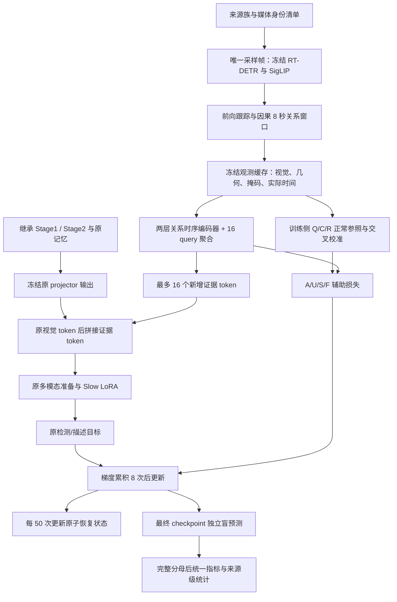

# NC-RTED 代码设计与实施边界

日期：2026-10-09。唯一研究规格仍是 [EXPERIMENT_SPEC.md](EXPERIMENT_SPEC.md)。本文定义实现接口、依赖与验收，不改变研究矩阵、监督权限、截止日期或评价协议。

当前版本为候选实现，尚未冻结，也没有启动正式训练。用户正在准备 PRO6000 镜像；具体型号、显存、驱动、挂载与吞吐未核验。硬件适配以实测为准，不把它当作 H100 的等效替代，也不据此扩充租用预算。

## 1. 执行图

教师只在离线训练侧生成。部署输入没有参照视频、校准分布、训练标签和来源身份。公共缓存不含可训练模块的结果、Slow KV 或回答。

## 2. 模块职责与现状

| 文件 | 职责 | 当前证据与剩余工作 |
|---|---|---|
| `src/nc_rted/loading.py` | 严格恢复旧非 LoRA、旧 LoRA、训练后的 projector，精确设置训练权限 | 真实 Stage2 CPU 加载已通过；GPU 前向尚待验收 |
| `observation.py` | 2 FPS 因果采样、实际 SigLIP patch ROI 池化、背景有效性、相对几何 | CPU 契约与观察器/缓存测试通过；实际 RT-DETR snapshot 已取得并校验；完整 Slow 缓存等价待验收 |
| `tracking.py` | 固定 IoU/外观/短时间隔的单向关联，人物参与的候选对 | 已接入因果媒体观察器；实际检测器已在固定训练窗口运行；全量教师覆盖待验收 |
| `features.py` | 把窗口内所有已观察关系整理为四格特征；分离静态检索与过程特征 | 学生 4620 维、过程 3473 维已实现；速度与最早实际锚点回归测试通过 |
| `alignment.py` | R 侧稳健尺度与四格受限单调对齐 | 已接入 teacher_pipeline；实际正常参照覆盖待测 |
| `retrieval.py` | 静态兼容距离、R 留一来源阈值、Q/C/R 来源隔离与支持选择 | 边界/别名/五折流水线测试通过；全量真实观测教师待构造 |
| `teacher.py` | 尾部比例、允许空证据的分解目标、U 的强度分布匹配 | 数值与来源权限测试已有；真实覆盖率未测 |
| `model.py` | 两层 384 维时序编码、质量/位置预测、16-query 聚合 | 掩码、置换、梯度和跨块测试通过 |
| `bridge.py` | 原 projector 后拼接，并调用真实 Slow 准备/训练/生成接口 | 原准备方法 + 小型真实 Qwen/PEFT 测试通过 |
| `batches.py` | 打包全部描述块、每对关系的实际时间与缺失掩码 | CPU 接口测试通过，接收完整媒体的已构造块 |
| `training.py` | 固定样本顺序、两组学习率、累积/更新、进度发布 | 已接入生产训练入口及原任务 provider；真实全链路运行待验收 |
| `recovery.py` | 增量参数、优化器、调度器、RNG、顺序及哈希的原子保存/恢复 | CPU 中断对照逐张量一致；真实长输入与设备迁移待验收 |
| `manifests.py` | 来源/别名隔离、检测前缀、描述指令、官方问题身份与发布哈希 | 元数据构造已有；最终冻结清单仍待复核 |
| `queue.py` / worker | 依赖、租约、独占设备、心跳/进度、有限重试、结果校验 | 候选实现；仍需独立审查与实际进程生命周期验收 |

“模块测试通过”不表示整个流水线完成。生产训练入口已实现；真实教师生成、正式预测/官方统计入口、进程生命周期及所有冻结门槛仍需验收。

## 3. 冻结观察接口

每个样本的学生输入为 `features[B,N,E,4,4620]`、`valid[B,N,E,4]` 和关系各自的实际 `observed_times[B,N,E,4]`。模型兼容广播的 `[B,N,4]` 时间输入，但生产组装使用每对关系的实际观测时刻。本配方 `B=1`，`E<=16`。检测使用 `N=1` 的最近 8 秒；描述使用完整已观察媒体的全部顺序 8 秒块。最后不足 8 秒的块也保留。

采样基于全局 2 FPS 网格，读取不晚于网格点的实际帧；去重、限制到查询前 8 秒、最多 16 帧。描述的分块左边界显式传入 `window_start_s`；最后不足 8 秒的块不回退成重叠窗口。不能以未来帧补齐空格。缺失观测与无候选是显式状态，不等于正常。

RT-DETR 原图框映射到原 SigLIP 的直接 384×384 resize。27×27、stride 14 的实际 patch 覆盖 378×378 区域；边缘剩余像素不虚构成一个 patch。ROI 按实际面积相交池化。检测区域外背景不足时拒绝提供有效背景描述。

跟踪只读已处理帧。关联阈值写在 `NC_RTED_TRACKING_CONTRACT.md`，冻结前固定，不据测试指标选择。局部轨迹编号只用于组装，不传给学生。窗口组装必须保留在窗口早段出现、末帧已离开的候选；不能只保留末帧关系。

缓存键至少绑定媒体内容哈希、解码/采样规则、实际时间戳、检测器实现与权重哈希、SigLIP/预处理哈希、ROI/跟踪/特征 schema。共享缓存保存原 dtype；训练读取时不得写回新 token。

## 4. 教师构造接口

教师记录保留离线审计 ID、Q/C/R 来源与别名组件、三个参照、匹配及校准支持状态、原始 `d`、有效掩码、`M`、`p`、`a`、`pi`。只有数值目标和独立辅助资格掩码进入损失；ID 不进入学生。

固定五折：Q 为 k，C 为 k+1，其余三折为 R。相同内容别名组件必须同折；此前反复检查的来源限制到增量训练。来自官方测试的同内容别名不能参与增量拟合。官方测试完整分母保留，并另做预定义污染敏感性报告。

静态检索只能使用可靠背景、类别组成、初始几何及候选/有效格支持；过程变化不参与参照选择。距离字段、尺度、阈值算法、稳定并列排序规则必须在配置中冻结。目标与 C 使用相同 R，三个参照来自不同来源族；兼容 C 最多 128、至少 64 窗口/16 来源族、每族最多 4 个。不足时 `aux_valid=false`，不把它写成 `a=0` 的正常教师。

R 侧过程标准化和受限 DTW 已单独实现；完整静态索引、正常支持清单和五折批处理尚未被实测通过。因此教师覆盖率是正式冻结前的检查项，不能从公式正确推断覆盖充分。

U 只重排同一数据集、唯一有效训练窗口的 F 质量值，保持直方图完全相同。S/F 逐样本共享质量。四组共享原距离、有效性、样本、初始化规则和训练步数。描述不生成教师目标。

## 5. Slow 接口与梯度边界

`SlowInputs.visual_embeddings` 是已有记忆经过旧 `mm_projector.mlp` 的 `[1,L,3584]` 张量。`bridge.prepare()` 将它与证据分支输出拼接，再调用继承的 `prepare_inputs_labels_for_LLM`。旧 token 的值不变，新 token 不参与旧记忆压缩，也不写回共享记忆。

`enabled=false` 不运行证据模块，直接传入原张量。无候选也返回原张量；不追加一组零 token。准备接口检查实际长度和保留的监督 token 数，发现截断就失败，不靠截断通过容量检查。

质量 `a_hat` 乘到 resampler 的 value；`log(pi_hat)` 进入其 attention logits；语言投影无 bias。这保证两者连接到实际 Slow 输入。所有描述块参与相同 16-query 聚合，带实际时间编码。

继承 Slow 不 merge LoRA。其内部只有原 LoRA 参数可训练；新分支参数也训练。冻结原视觉编码器、projector、Fast、旧记忆、触发与融合。训练主损失调用原 Slow CausalLM 目标，辅助项固定乘 0.1。描述拒绝传入教师对象，辅助项严格为零。检测的 U/S/F 必须显式提供教师或拒绝资格掩码，不能静默漏掉教师。

桥接器明确绑定学生与 Slow 的设备和前向 dtype；缓存特征转到学生 dtype，实际时间先以 FP32 编码，再将三个时间特征送入对应 dtype 的线性层。旧视觉 tensor 若设备/dtype 不符会拒绝，避免静默改写原路径。FP32 优化器主参数独立于前向 dtype。

生成要求先显式 `bridge.eval()`，避免训练后的 dropout 混入贪心结果；调用绕过会重建视觉输入的 Llava 包装入口，使用原 Qwen 父类的 `generate(inputs_embeds=...)`。完整继承的生成配置由生产入口传入；测试中的短生成只用于接口验证，不是正式协议。

## 6. 训练、恢复与正式作业

同一 seed 的 A/U/S/F 在构造新模块前设置同一 Python/NumPy/Torch seed，使用同一 8,000 样本 ID 排列；不同 seed 不同。每次从原 Stage2 加载，绝不从另一组 final 接续。

训练核固定 microbatch 1、累积 8、1,000 次有效更新、AdamW、weight decay .01、新模块 LR 1e-4、LoRA LR 5e-6、50 次 warmup、梯度裁剪 1.0。梯度累积和优化器使用 FP32。更新序号从 1 计，第 1–50 次使用 `k/50` 倍 LR，第 51–1000 次使用 `(1001-k)/950` 倍 LR；1000 次计数均有正学习率，结束后的下一状态为零。该明确调度是待审查冻结的工程细节，不进行扫描。正式入口必须核验完整配方及 8,000 样本清单；缩小测试不进入正式矩阵。

前向保留 BF16 参数；AdamW 使用独立 FP32 主参数和动量，避免小学习率更新在 BF16 权重中逐次被舍入掉。更新后同步前向权重，恢复时必须加载 FP32 主参数，不能从舍入后的 BF16 权重重建。

`CheckpointStore` 的 v2 格式保存所有可训练 tensor、FP32 主参数、完整 optimizer/scheduler、Python/NumPy/CPU/CUDA RNG、完整样本顺序、cursor、update，以及代码/配置/数据/教师/旧权重/运行环境哈希。禁止在半次梯度累积中保存。每 50 次更新保存恢复状态，只保留两份滚动恢复和 final，不触及原始权重。

提交过程为临时目录写入并 fsync、写入载荷哈希清单、原子 rename、更新 latest 指针。恢复扫描已提交目录，因此在 rename 后、指针更新前中断仍能恢复。残留 pending 目录不能作为成功状态；在获取存储写锁后，只回收带匹配所有权标记的中断写入/轮转产物，先保留故障元数据，未识别文件不删除。恢复逐项检查优化器参数名称顺序、动量形状/dtype/有效值与步数。不同 CUDA 设备数量的 RNG 恢复需单独验收。

训练核用 `publish_progress()` 原子发布 `{counter:update,cursor,...}`；它表示更新进度，不是持久 checkpoint。作业重启按最后提交 checkpoint 回滚未提交工作，最终不重复计数、不跳样本。心跳不能替代该进度。

正式 worker 只接受冻结版本和输入哈希。进程退出 0 不等于作业验收；训练结果需验证 final 更新数/身份/载荷，预测结果需核对全部媒体或问题 ID、技术失败与输出哈希。设备租约、截止和磁盘保护触发时，必须确认子进程停止才能释放设备；未知存活状态保留保护，禁止重复启动。

当前实际新增参数为 7,150,850，继承 LoRA 为 161,480,704。按 BF16 前向 + FP32 主参数与两份动量，单份完整恢复载荷约 2.20 GiB；12 个运行都保留两份恢复和 final 约 79.15 GiB，尚不含序列化开销。原 45 GiB 检查点内部配额不足，需要在已授权总存储内重新分配并实测；这不授权扩大总预算，也不证明新增存储已挂载。

## 7. 评测实现约束

R0 没有增量训练，A/U/S/F 各三 seed，固定 13 个模型。每模型 251 UCF、800 XD、3339 HIVAU 问题。描述按问题 ID 生成，不能把 1369 个独立媒体数当问题分母。派生媒体只做一次，回答仍逐问题保存。

Fast、SigLIP、冻结观察及经验证的旧记忆可共享；Slow 推理独立。预测目录和训练 worker 不含测试答案/指标。所有模型和分母冻结完成后才解锁官方指标。统计脚本在盲测前实现并以合成数据审查，不能根据最终效果换检验。

统计按来源族一起重采样所有模型与 seed，每次在加权全量预测上重算 AUC/AP；计算每 seed 的 F-A/U/S 后取均值。10,000 次 bootstrap、六项主比较的 Holm 校正、未校正 CI、效应、各 seed 结果与均值/SD 均保留。

## 8. 冻结前尚需完成的验收

1. RT-DETR 版本/权重/预处理绑定、实际观测缓存、完整特征 schema 与静态检索/交叉教师集成。
2. 8,000 训练清单、别名组件隔离、额外只读正常观察披露、官方媒体与问题身份逐项复核。
3. 生产训练/推理入口与 checkpoint/预测语义验证器；worker 子进程生命周期、进度超时和保护性停止测试。
4. 独立 Astra 对确切代码/配置审查，修复后复测。各模块已有范围受限的静态审查，修复后复测；它们不能替代全规格正式放行。
5. PRO6000 真实环境核验，以及完整 7B 最长分层输入 forward/backward、缓存等价、真实参数更新、保存重载、未来帧不变性、生成与冷缓存吞吐。
6. 根据实测吞吐、空间、租约和绝对截止重算完整 12 次训练/13 模型评测时间线。不得因估算不足缩小协议而宣称完成。

只有上述证据通过才生成 `configs/frozen.yaml` 并开放正式作业。当前代码设计可以审阅，实验可行性与统计效果仍需实际数据证明。

已有审查与实测记录：`reports/nc_rted/review_cli/astra_bridge_recovery_review_v3.json` 对 `ed793ab` 中模型/桥接/训练/恢复源码给出 `PASS_STATIC`，九项已知问题在静态层面消除；审查者未运行测试，该结论不覆盖整个流水线。`reports/nc_rted/real_stage2_fp32_master_updates_v1.json` 记录真实继承 Stage2 在合成短输入上的 CPU 两步更新：392 个 LoRA 前向张量均变化、新分支 38 个 FP32 主参数均变化，冻结 projector/词嵌入未变。它不是实际视频或最长输入 GPU 验收。

## 训练与教师生产链路补充（2026-10-09 候选）

`task_inputs.py` 按 provenance 读取固定训练来源及原始描述指令。真实 8,000 条清单已成功接入，Qwen 原 tokenizer/label mask 已做逐项一致检查；这不替代完整媒体运行验收。

`inherited_memory.py` 保留原描述 projector forward 与原检测 streaming MemoryManager + projector.mlp 两条路径，直接调用原实现；不能把描述原有时空位置注入静默套到检测上。输出保持 dtype，并转为可安全参与 LoRA backward 的普通 detached tensor。

`train_worker.py` 把 catalog、冻结媒体 provider、原预处理、teacher 对齐、Slow bridge、FP32 master optimizer 与恢复存储接起来。provider 只接样本身份，答案与教师由 worker 在其后读取。正式与诊断 checkpoint 身份隔离，正式入口校验全量 recipe、十项验收和精确源文件绑定。生产媒体 provider 已接入；队列资源准入及全部正式放行证据仍待完成。

`teacher_pipeline.py` 对每个目标窗先一次选定三个参照窗，再做窗口内静态关系匹配和短序列过程距离，C 统计量必须由各自整窗有效单元最大值构成。`teacher_records.py` 是冻结观测到训练期教师的紧凑内存接口；完整数据持久化需二进制分块，避免数十 GiB 的浮点 JSON。训练入口必须接收全部 6,000 个窗口的成功/拒绝行，不能因教师覆盖不足改变样本分母。

`statistics.py` 在同一来源重采样上比较各组与三个 seed，再合并配对差异并做六检验 Holm。来源抽样次数作为原帧权重；不以来源长度归一化替代官方全帧 AUC/AP。统计代码只在盲预测冻结后由隔离评测进程使用。

以上模块均为候选实现。RT-DETR 本地完整 snapshot 与实际来源绑定、真实最长视频、GPU吞吐、缓存数值等价、完整断点/队列恢复和独立全链路复核尚不能标为通过。GitHub 上传已获授权，发布内容只包含代码、必要配置、文档和测试；不包含权重、原始媒体、凭据或运行日志。

## 真实任务输入接入补充

检测新增 `detection_media.py` 和 `detection_provider.py`：显式绑定媒体与 Fast query snapshot，惰性解码选中前缀、原 MemoryManager 回放、目标 query 的原 RT 四帧路径和提示词，最终接入同一 `SampleMaterial`。当前训练 provider 会对固定标签前缀构造目标；正式评测入口必须继续保留原触发和融合，不能把训练强制调用当评测策略。

描述新增 `caption_sampling.py` 和 `caption_provider.py`：在原 `_get_item` 的一次解码内捕获 `process_video` 采样审计，保留原逐帧 PG 分数，按继承模型 BF16/device 处理视觉输入并调用原 projector。固定清单使用真实整数 instruction ID；原 loader 的绝对 `video` 与 `_reactvau_relative_video` 分开核验。新2FPS关系观察不会覆盖原 caption 的时间提示。

`teacher_store.py` 提供无 pickle 的逐窗口压缩 NPZ、哈希索引、明确拒绝行、磁盘余量检查、fsync和不可覆盖的原子提交；`nc_rted_build_teacher.py --store` 从该存储接完整教师构造。已写出的存储不会被新运行覆盖。

真实 Fast snapshot 已导出候选并覆盖 6,000 个检测前缀，RGB/时长 observer 和训练入口已实现；仍需被接受的 RT-DETR snapshot、真实全链路运行、完整盲预测入口、正式结果语义验证和队列恢复验收。媒体 provider 的契约通过不代表这些外围依赖已经具备。源级独立审查只覆盖本轮明确列出的文件；正式冻结仍须全规格验收。

## 因果媒体观察与共享缓存实现

新增 `media_observer.py` 将绑定媒体接到既有 detector/tracker/features。检测按绝对2FPS网格读取当前8秒，描述按完整已观察媒体依次处理8秒块和尾段；一次只持有当前块RGB。时间使用实际选中帧索引及已核验CFR帧率。固定2000描述指令均无start/end覆写；不支持的区间覆写会明确拒绝。真实CFR/PTS核验仍是数据验收要求。

媒体lease对同一打开文件句柄做SHA校验，decoder使用 `/proc/self/fd`；每块RGB解码前后检查同一inode状态，确认后才生成公共特征。退出异常也保留完整性检查。合法无检测框对应无候选旁路，不当作正常标签或技术失败。

缓存升级为v2：每帧独立tensor存储、内容校验、损坏失效重算、进程锁、固定数量的填充锁、原子临时文件与LRU容量限制。模型身份在加载时验证，包含SigLIP实际保留权重、预处理、源码、dtype/device；不会在每个8秒块重复读取整套权重。

核心CPU用例通过不能证明检测器资产、最长输入梯度、PRO6000吞吐或正式运行就绪。生产训练 CLI 已完成接口实现与 CPU 测试，真实运行及完整盲预测生命周期仍待验收，formal_execution_allowed 保持 false。

## 生产训练装配入口

`production_runtime.py` 与 `scripts/nc_rted_train.py` 把来源清单、原 Stage2 数据集、Fast 快照、媒体观察器、教师存储、模型与恢复 worker 接成单一入口。诊断和正式运行身份分开；正式 admission 是独立的外部文件，不与运行配置形成循环自哈希。

装载模型前，检测任务必须在 Fast 快照与观察目录中匹配同一媒体 SHA、FPS、帧数、尺寸和查询截止帧；描述必须逐项匹配固定 2,000 条原始指令及原 PG 分数。继承 `llava`/`eval_utils`/`vad` Python 源码完整列入哈希清单，导入来源必须一致。原视觉塔使用继承 projector 的 dtype，并在 provider 调用前恢复冻结 eval 模式。

`--dry-run` 只报告 `FILE_BINDINGS_PASS_SEMANTIC_NOT_RUN`。运行清单契约见 `NC_RTED_PRODUCTION_RUNTIME_CONTRACT.md`；当前未冻结正式配置，没有正式训练或官方预测结果。完整 CPU 回归 217 项通过，真实 6,000 个检测前缀的 Fast/observer 元数据装配检查通过；这些证据不覆盖当前媒体全量重哈希、CFR/PTS 或 GPU 前向。

## 真实观测数值修复（2026-10-09）

RT-DETR 已取得固定 revision 的完整本地权重并逐文件校验。实际4090运行揭示两类公共缓存错误：严格序列化拒绝 NumPy 标量框坐标；SigLIP BF16输出随缓存未命中批量大小改变，且冷/热patch布局差异会改变区域汇聚舍入。新增观察分支统一逐帧编码与连续patch布局，并将策略、源码和设备信息绑定到缓存键；原ReactVAU任务的批量规则不变。细节与失败证据见 `NC_RTED_FROZEN_OBSERVATION_NUMERICS.md`。

固定6000检测前缀的2413个训练媒体当前文件哈希全部通过，逐帧PTS/CFR全量检查正在独立CPU进程运行。2000条描述指令均能由继承Stage2索引解析到现有原始视频（666整视频、1334临时clip/event）；缺少派生view目录不等于缺原始媒体。正式使用仍需完整resolver运行、存储余量和派生媒体校验，不能仅靠路径解析放行。
